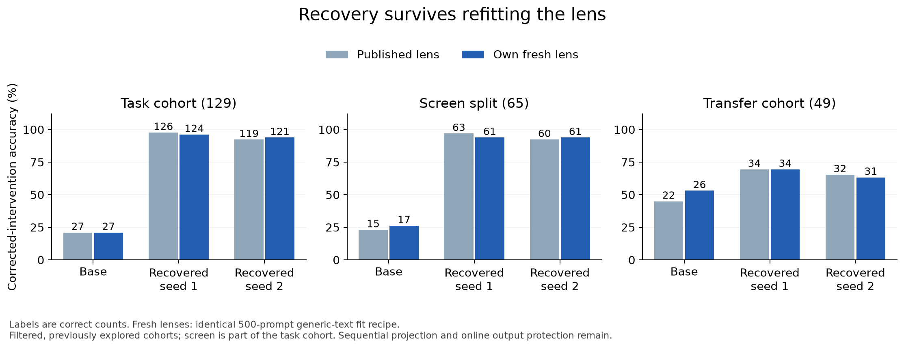

# Lesion-induced functional compensation in a language model


A 4B model was trained on a two-hop geography task while its top-10 eligible
J-lens directions were continuously suppressed at six middle decoder blocks. The
lesion stayed active during **every** training forward pass. Accuracy on a
held-out cohort of countries excluded from training rose from 20.9% to 97.7%,
and the recovery survived lenses refit to the adapted models.

See the blog post [here](dshah.dev/blog/lesion).

The narrow supported claim is **functional adaptation around this particular
persistent intervention**. This is not evidence that a global workspace was
reconstructed, that every J-space representation was avoided, or that the exact
compensating heads and features were identified.

| Model / training | Published-lens J accuracy | Own-fresh J accuracy | Clean accuracy |
|---|---:|---:|---:|
| Base | 27/129 (20.9%) | 27/129 | 129/129 |
| J-trained primary | 126/129 (97.7%) | 124/129 | 127/129 |
| J-trained second seed | 119/129 (92.2%) | 121/129 | 129/129 |
| Random-trained control | 75/129 (58.1%) | not evaluated | 126/129 |
| Sham-trained control | 85/129 (65.9%) | not evaluated | 126/129 |



The intervention follows the method in Anthropic's
[Verbalizable Representations Form a Global Workspace in Language Models](https://transformer-circuits.pub/2026/workspace/index.html),
with the differences and limitations documented below.

## Model checkpoints

**Checkpoints aren't in this repo, please DM me to get access.**

The two final model checkpoints are ~17 GiB each (~34 GiB total), which is far
past what belongs in a git repository. Their file paths, byte sizes and
save-time SHA-256 hashes are recorded in
`CHECKPOINTS.json` and `results/final-training/arms/*/checkpoint-manifest.json`,
so anything you receive can be verified against what produced these numbers.

The base model (`Qwen/Qwen3.5-4B` at revision
`851bf6e806efd8d0a36b00ddf55e13ccb7b8cd0a`) and the published Neuronpedia J-lens
are both public; see [TRAINING.md](TRAINING.md) for how to fetch them. The three
500-prompt fresh lenses are also available on request.

You do **not** need any checkpoint to verify the reported numbers — every
per-example prediction and metric is bundled here.

## Verify the results without a GPU

This repository uses [uv](https://docs.astral.sh/uv/). Every analysis script
carries PEP 723 inline metadata, so `uv run` resolves what each one needs on the
fly — there is no environment to create first, and nothing installs the GPU
stack.

```bash
uv run scripts/verify_release.py
uv run scripts/audit_release.py --output .audit-output
```

The verifier checks every bundled file hash against `SHA256SUMS`. The audits
recompute saved-token correctness, training order, baseline parity, lens and
checkpoint bindings, country-grouped uncertainty, and the fresh-lens comparison —
all without GPUs and without rerunning the language model.

Regenerate the figures the same way:

```bash
uv run scripts/plot_final_capability.py \
  --audit results/final-training/RECEIPT_AUDIT.json --output .audit-output/figures
uv run scripts/plot_final_fresh_lens.py \
  --audit results/fresh-lens/RECEIPT_AUDIT.json --output .audit-output/figures
```

If you would rather have one environment than a per-script one:

```bash
uv sync --only-group analysis
```

Working on the model code is a different matter. `uv sync` installs the whole
project, whose Torch is pinned to the CUDA wheel index, so it resolves only on
Linux with CUDA — it will fail on macOS. On a suitable machine, `uv sync` then
`uv run pytest -q tests` runs the test suite.

## Run the training yourself

See **[TRAINING.md](TRAINING.md)** for the full path: runtime build, lens
download, cohort construction, the exact training invocation, and every
intervention and optimizer setting that produced the reported result.

## What's here

This repository is scoped to three things: the **ablation**, the **lens
refitting**, and the **probes**. Code for unrelated task families explored along
the way (GSM8K, HotpotQA, cipher, silent-arithmetic, graph tasks, the TRL/veRL RL
stacks) is not included. The training here is plain supervised fine-tuning — a
`torch.optim.AdamW` loop with the lesion applied through forward hooks — so the
dependency set is just Torch, Transformers, `jlens`, NumPy and PyYAML.

| Path | Contents |
|---|---|
| `src/jspace_plasticity/intervention.py` | The lesion itself: J-lens direction selection and sequential projection removal. |
| `src/jspace_plasticity/synthetic_recovery_sft.py` | Training entrypoint — SFT with the lesion active on every forward pass. |
| `src/jspace_plasticity/lens/` | J-lens fitting (`fit_exact_dp.py`), download, and geometry. |
| `src/jspace_plasticity/probe.py`, `evals/*_probe*.py` | Probe fitting and the geography/country/two-hop probes. |
| `src/jspace_plasticity/evals/final_fresh_lens.py` | Fresh-lens evaluation across all eight model×lens conditions. |
| `results/final-training/` | Per-example predictions and optimization metrics for all four arms. |
| `results/fresh-lens/` | Fresh-lens fits and the eight evaluation conditions. |
| `results/calibration/` | Learning-rate calibration that selected the reported run. |
| `results/corrected-figures-20260908/` | Per-prompt kurtosis/severity metrics and capture parity for the activation diagnostics. |
| `figures/` | PNG/PDF/SVG exports plus the source CSVs behind every figure. |
| `data/` | Frozen task source, GeoNames extracts with attribution, WikiText manifest, the eligible training cohort, and the design files. |
| `docs/` | Experiment review, reproducibility guide, executed commands, related work. |
| `runtime/` | Dockerfile for the GPU training environment. |
| `scripts/`, `tests/` | Verification/audit/plotting scripts and the test suite. |

Numbers behind the write-up's figures live in
`figures/corrected-20260908/corrected_country_bootstrap.csv` (estimates with
95% country-bootstrap intervals) and `corrected_measurements.csv` (per-prompt).

## Limitations

This was exploratory. The task, layer band and intervention settings were
selected after earlier approaches failed, and that search history matters for
interpreting the result.

The 64-row validation subset selected learning rate and duration; the 65-row
screen subset and the 49-prompt transfer cohort had prior exploratory exposure,
so they are not independent replications. Country separation applies to this SFT
experiment — it does not imply the pretrained model never encountered those
countries.

Recovery is uneven across relations (capital 49/50, currency 23/24, region
54/55 for the primary run), and the region label space is the easiest of the
three.

The J-space intervention caused more generic text disruption than its matched
random control in earlier diagnostics. This should be described as adaptation
around a **J-lens-derived structured activation perturbation**, not as recovery
from a proven surgically selective workspace lesion.

Fresh-lens validation here consists of prediction parity and continued
disruption of the base model. It did not run the original paper's separate
lens-quality certification suite, and fresh lenses were not fit for the sham and
random-trained controls.

`docs/EXPERIMENT_REVIEW.md` has the issue-by-issue verdict, including why the
learning rate changed from `1e-5` to `1e-6` between the superseded August run
and this one.

## A note on redactions

The original runs executed on a private cluster. Its Kubernetes/Volcano job
manifests and registry-bound Dockerfiles are **not** published here, and
occurrences of the private container registry, shared-storage mount and home
directory were replaced with `<CONTAINER_REGISTRY>`, `<AWS_ACCOUNT_ID>`,
`<SHARED_STORAGE>` and `<HOME>` inside receipts and configs.

**No numerical value was altered.** Every `predictions.jsonl` is byte-identical
to what the original runs produced, and still carries its original
`predictions_sha256`, so the per-example results remain provably unmodified.

Redaction did change the bytes of the metadata receipts that quote those paths
(design files, run summaries, per-arm `result.json`), which broke the SHA-256
bindings between them. `scripts/rebind_redacted_receipts.py` recomputed only
those derived receipt-to-receipt bindings — `design_sha256`, `result_sha256`,
`fit_result_sha256` and the `SUMMARY.sha256` sidecars. It does not touch
prediction hashes or any measurement. `SHA256SUMS` was likewise regenerated over
the files as published, so `scripts/verify_release.py` verifies this repository
rather than the original internal archive.

You can verify this repository is internally consistent and that its predictions are the originals, but you cannot
use these hashes to prove the metadata receipts are byte-identical to the
internal archive. Run `uv run scripts/rebind_redacted_receipts.py` to confirm
the bindings are stable (it is idempotent and reports no changes on a clean
tree).

## License and citation

Code and documentation are Apache-2.0 (`LICENSE`). Third-party material retains
the terms in `THIRD_PARTY_NOTICES.md` and `licenses/`. Citation metadata is in
`CITATION.cff`.
